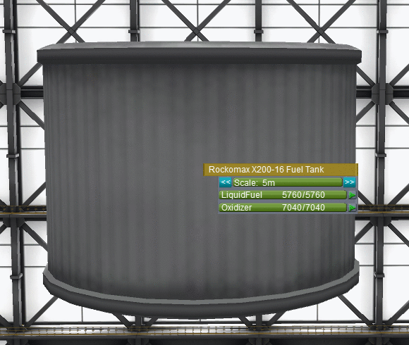
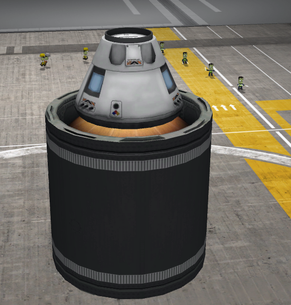
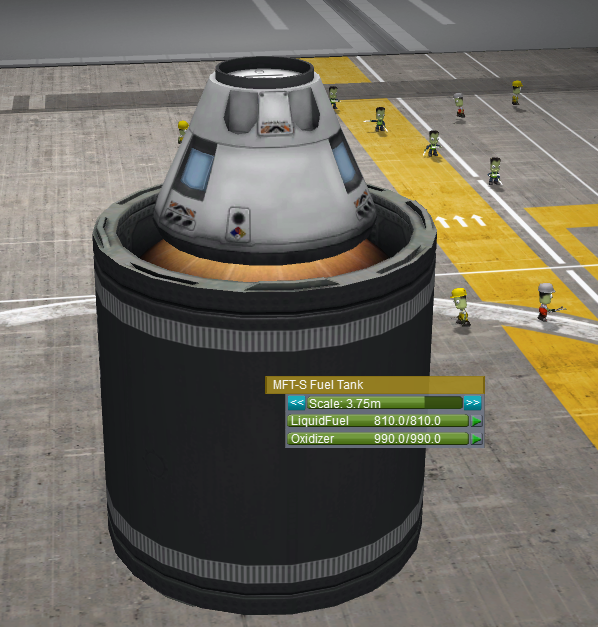
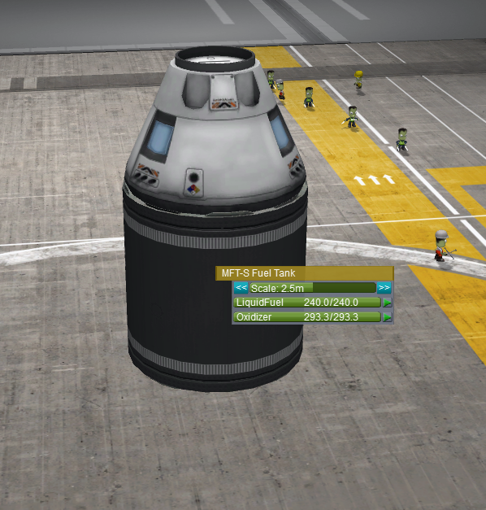
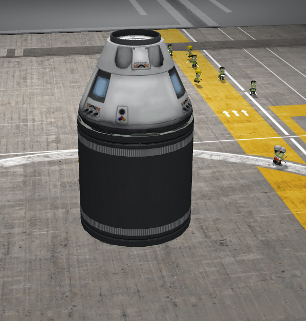

# TweakScale /L : Under New Management
- - - 
*Lasciate ogne speranza, voi ch'intrate*
- - - 

**TweakScale** lets you change the size of a part.

**TweakScale /L** is TweakScale under Lisias' management.

**This is a Beta Release** ! Don't use on "production" installs. Patches and interfaces are expected to change between releases.


## In a Hurry

* [Source](https://github.com/net-lisias-ksp/TweakScale)
	+ [Issue Tracker](https://github.com/net-lisias-ksp/TweakScale/issues)
	+ [Orthodox (development) Branch](https://github.com/net-lisias-kspu/TweakScale/tree/dev/orthodox)
		- " *Lasciate ogne speranza, voi ch'intrate* "
* Documentation
	+ [Forum](https://forum.kerbalspaceprogram.com/index.php?/topic/179030-141-tweakscale-under-new-management/&)
	+ [Homepage](http://ksp.lisias.net/add-ons/TweakScale) on L Aerospace KSP Division
	+ [Project's README](https://github.com/net-lisias-ksp/TweakScale/blob/master/README.md)
	+ [Install Instructions](https://github.com/net-lisias-ksp/TweakScale/blob/master/INSTALL.md)
	+ [Change Log](./CHANGE_LOG.md)
	+ [Known Issues](./KNOWN_ISSUES.md)
* Official Distribution Sites:
	+ [CurseForge](https://kerbal.curseforge.com/projects/tweakscale)
	+ [SpaceDock](https://spacedock.info/mod/127/TweakScale)
	+ [Homepage](http://ksp.lisias.net/add-ons/TweakScale) on L Aerospace
	+ [Source and Binaries](https://github.com/net-lisias-ksp/TweakScale) on GitHub.
	+ [Latest Release](https://github.com/net-lisias-ksp/TweakScale/releases)
		- [Binaries](https://github.com/net-lisias-ksp/TweakScale/Archive)


## Description

TweakScale lets you change the size of a part. Not just that, but it will figure out how much fuel is in the resized part. And if it's an engine, it will become more powerful by scaling it bigger, or weaker by scaling it smaller.



TweakScale uses Swamp-Ig's KSPAPIExtensions and Module Manager.

### Notes

From Version 1.5.0.1, KSPAPIExtensions.dll should no longer reside in GameData, but in Gamedata/TweakScale/Plugins. If you have a KSPAPIExtensions.dll in your Gamedata/ folder, please delete it.

Please add TweakScale to your mod!
If you are a mod author and you want to bundle TweakScale with your mod, please do! A few notes:

* Please place your TweakScale .cfgs in your mod's folder, not in the TweakScale folder. This way users can delete TweakScale and install a new version without breaking your mod.
* If your mod is already on the list of supported mods, please post here or PM me, and I will remove support, giving you full control over the .cfgs.


### Anyways, features:

#### Scaling Control
You as the author of a part or addon get complete control over which parts you want to offer in which sizes. Should that fuel tank only be available in size 2.5m and 3.75m? Make it so! That RCS thruster on the other hand, could be scalable freely between half regular scale and double regular scale.

#### Mass Control
For heavy, solid parts, mass increases with the cube of the scale - you scale it in three dimensions, after all. For parts that are a thin layer of aluminium plates over a rigid skeleton - like fairings, crew compartments, empty fuel tanks - mass probably scales closer to the square of the scale.

#### Rescales Stock parts
Engines, RCS thrusters, fuel tanks, boosters, reaction wheels, air intakes, control surfaces and solar panels are supported, and have their physical properties updated to sensible values when rescaled.

#### Integration with Modular Fuel Tanks, Real Fuels and KSP Interstellar
TweakScale correctly changes fuel volumes on tanks using Modular Fuel Tanks and Real Fuels. It correctly adjusts power output, waste heat, microwave transmission and other stuff for KSP Interstellar parts. Thus far, the following are supported:

* Solar Sails
* Microwave Receivers
* Atmospheric Scoops
* Atmospheric Intakes
* Heat Radiators
* Alcubierre Drives
* Engines (Except the Vista Engine)
* Antimatter Storage Tanks
* Generators
* Fusion Reactors

Fission reactors, antimatter reactors and antimatter-initiated reactors are not yet supported. (Awaiting better formulae for those and the Vista engine)

### How to Use
First add a part that's the wrong size:


Right click:


See how it says 3.75m? Well, the command capsule is 2.5m, so let's change it. You do this by pressing the << >> buttons or dragging the slider.


See how well it fits?



### Examples
For a part that should be available in 62.5cm, 1.25m, 2.5m, 3.75m and 5m configurations, and by default is 1.25m, use the following definition:

```
MODULE
{
    name = TweakScale
    defaultScale = 1.25
    type = stack
}
```

If the part should instead be freely rescalable, use this:

```
MODULE
{
    name = TweakScale
    type = free
}
```
And for a part that should be available in 25%, 50%, 100% and 200% scales, use:

```
MODULE
{
    name = TweakScale
    type = surface
}
```

But I said you had full control of scales, didn't I? If you want your parts to be available only in 2.5m and 3.75m versions, use this definition:

```
MODULE
{
    name = TweakScale
    type = stack
    scaleFactors = 2.5, 3.75
    scaleNames = 2.5m, 3.75m
}
```

If your mod has a collection of parts that will all be available in the same set of sizes, you might want to make your own scale type:

```
SCALETYPE
{
    name = MyMod
    freeScale = false
    massFactors = 0.0, 0.0, 1.0
    scaleFactors = 0.5, 1.0, 2.0
    scalenames = Small, Medium, Large
    defaultScale = 1.0
}
```

After defining this once, you can then start using it for your parts:

```
MODULE
{
    name = TweakScale
    type = MyMod
}
```

As you can see the scale type uses the same names as the module definition, and they can even inherit from other scale types (if you want to change just a small detail).

### Adding module support

You can now add support for your own modules! For a simple module that's happy with having its values changed when OnLoad is called, this is how:

```
TWEAKSCALEEXPONENTS
{
    name = MyPartModule
    
    flooberRate = 2
}
```

When a user rescales a part with a MyPartModule module, TweakScale will automatically update the flooberRate of the part with the square of the scale (so if it's a 2.5m part and it's scaled to 3.75m, the flooberRate will be 2.25 times its usual value [3.75/2.5 = 1.5; 1.5^2 = 2.25]).

New in 1.10 is the ability to change fields of fields - that is, myPartModule.someStruct.value or myPartModule.someList[x]:

```
TWEAKSCALEEXPONENTS
{
    name = ModuleGenerator
    outputList
    {
	   rate = 3
    }
}
```

The above config will scale all members of the list outputList on ModuleGenerator, to the cube of the current scale.

Note that this system works for any depth:

```
TWEAKSCALEEXPONENTS
{
    name = ModuleMyModule
    foo
    {
           bar
           {
               quxRate = 3
           }
    }
}
```

The above would scale ModuleMyModule.foo[x].bar.quxRate.

New in 1.19 is tech requirements:

```
MODULE
{
    name = TweakScale
    type = stack
    techRequired = basicRocketry, start, generalRocketry, advRocketry, heavyRocketry
}
```

Here, each option in the stack SCALETYPE will be unlocked by a corresponding tech. If there are fewer techRequired than scaleNames/scaleFactors, the unmatched scales will be unlocked by default.

It might be that your module would benefit more from using a list of values than an exponent. In that case, you may specify the list in the tweakscale module statement in the .cfg:

```
MODULE
{
    name = TweakScale
    type = stack
    defaultScale = 3.75
    
    MODULE
    {
        name = ModuleEngines
        maxThrust = 1, 2, 3, 4, 5
    }
}
```

Here, a 62.5cm version would have a maxThrust of 1, 1.25m would be 2, and so on until the 5m version has a maxThrust of 5.

If more advanced logic is required, TweakScale offers an IRescalable interface. Its definition is as follows:

```
public interface IRescalable
{
    void OnRescale(ScalingFactor factor);
}
```

ScalingFactor has the properties 'absolute' and 'relative'. Most likely, you want to use absolute. relative is the change in scale since last time OnRescale was called, while absolute is the change in scale in relation to defaultScale. absolute and relative have properties linear, quadratic, cubic and squareRoot, which are shorthands for different scaling factors.

IRescalable can be used in conjunction with .cfg exponents. In that case, TweakScale will first call IRescalable's OnRescale, followed by updates from .cfgs. (this may be changed in the future, as I'm not sure it's the best solution)

Due to limitations in .NET, an IRescalable either has to be implemented in an assembly of its own, or the entire assembly will be made dependent on TweakScale.

An example implementation of an IRescalable may be:

```
class MyModuleUpdater : TweakScale.IRescalable
{
    MyPartModule _module;

    public MyModuleUpdater(MyPartModule module)
    {
        _module = module;
    }

    public void OnRescale(TweakScale.ScalingFactor factor)
    {
        _module.flooberRate = _module.flooberRate * factor.relative.quadratic;
        _module.ReactToFlooberRate(13);
    }
}
```

and the new updater may be registered with TweakScale thusly:

```
[KSPAddon(KSPAddon.Startup.EditorAny, false)]
internal class MyEditorRegistrationAddon : TweakScale.RescalableRegistratorAddon
{
    public override void OnStart()
    {
        TweakScale.TweakScaleUpdater.RegisterUpdater((MyPartModule mod) => new MyModuleUpdater(mod));
    }
}

[KSPAddon(KSPAddon.Startup.Flight, false)]
internal class MyFlightRegistrationAddon : TweakScale.RescalableRegistratorAddon
{
    public override void OnStart()
    {
        TweakScale.TweakScaleUpdater.RegisterUpdater((MyPartModule mod) => new MyModuleUpdater(mod));
    }
}
```

For an example implementation, check out how Real Fuels support is implemented.

In case someone's confused:

* `MODULE { name = TweakScale ... }` goes in the PART you want scalable. (or a ModuleManager .cfg, of course)
* `TWEAKSCALEEXPONENTS` and `SCALETYPE` go top-level in some .cfg. It doesn't matter which, it doesn't matter where. As long as it's called .cfg and is somewhere in gamedata, it'll be correctly registered. The suggested location is `Gamedata/MyMod/MyMod_TweakScale.cfg`


## Installation

Detailed installation instructions are now on its own file (see the [In a Hurry](#in-a-hurry) section) and on the distribution file.

### License

* TweakScale is double licensed as follows:
	+ [SKL 1.0](https://ksp.lisias.net/SKL-1_0.txt). See [here](./LICENSE.SKL-1_0)
		+ You are free to:
			- Use : unpack and use the material in any computer or device
			- Redistribute : redistribute the original package in any medium
		+ Under the following terms:
			- You agree to use the material only on (or to) KSP
			- You don't alter the package in any form or way (but you can embedded it)
			- You don't change the material in any way, and retain any copyright notices
			- You must explicitly state the author's Copyright, as well an Official Site for downloading the original and new versions (the one you used to download is good enough)
	+ [GPL 2.0](https://www.gnu.org/licenses/gpl-2.0.txt). See [here](./LICENSE.GPL-2_0)
		+ You are free to:
			- Use : unpack and use the material in any computer or device
			- Redistribute : redistribute the original package in any medium
			- Adapt : Reuse, modify or incorporate source code into your works (and redistribute it!) 
		+ Under the following terms:
			- You retain any copyright notices
			- You recognize and respect any trademarks
			- You don't impersonate the authors, neither redistribute a derivative that could be misrepresented as theirs.
			- You credit the author and republish the copyright notices on your works where the code is used.
			- You relicense (and fully comply) your works using GPL 2.0 (or later)
			- You don't mix your work with GPL incompatible works.
	* If by some reason the GPL would be invalid for you, rest assured that you still retain the right to Use the Work under SKL 1.0. 
* Scale_Redist (`999_Scale_Redist.dll`) is licensed as follows
	+ [WTFPL](http://www.wtfpl.net), see [here](./Source/Scale_Redist/LICENSE)
		- You are free to:
			- Do whatever you want!
		- Under the following terms:
			- You follow your heart's desire. :)
* [Deprecating Patches](./GameData/TweakScale/Deprecating) and [Extra Patches](./Extras/TweakScale) are licensed as follows
	+ [WTFPL](http://www.wtfpl.net), see [here](./Extras/TweakScale/LICENSE)
		- You are free to:
			- Do whatever you want!
		- Under the following terms:
			- You follow your heart's desire. :)
* [KSPe.Light](https://github.com/net-lisias-ksp/KSPAPIExtensions/tree/local/TweakScale) is licensed to TweakScale under [SKL 1.0](https://ksp.lisias.net/SKL-1_0.txt)
	+ KSPe.Light is a lighweight version of KSPe, a component from KSP API Extensions /L.
	+ This library is not meant to general public consuption. Use [KSP API Extensions](https://github.com/net-lisias-ksp/KSPAPIExtensions/releases) instead.

See [NOTICE](./NOTICE) for further copyright and trademarks notices.


## References

* [pellinor](https://forum.kerbalspaceprogram.com/index.php?/profile/85299-pellinor/): PARENT / Previous Maintainer
	+ [Forum](https://forum.kerbalspaceprogram.com/index.php?/topic/101540-14x-tweakscale-v2312apr-16/)
	+ [SpaceDock](http://spacedock.info/mod/127/TweakScale)
	+ [CurseForge](https://kerbal.curseforge.com/projects/tweakscale)
	+ [GitHub](https://github.com/linuxgurugamer/TweakableEverything)
* [Biotronic](https://forum.kerbalspaceprogram.com/index.php?/profile/72381-biotronic/): ROOT
	+ [Forum](https://forum.kerbalspaceprogram.com/index.php?/topic/72554-090-tweakscale-rescale-everything-v150-2014-12-24-1040-utc/&)
	+ [CurseForge](https://kerbal.curseforge.com/projects/tweakscale)
	+ [GitHub](https://github.com/Biotronic/TweakScale)
* Originaly Forked from [Gaius Goodspeed](https://forum.kerbalspaceprogram.com/index.php?/profile/66495-gaius/)'s [Goodspeed Aerospace Part & TweakScale](https://forum.kerbalspaceprogram.com/index.php?/topic/65819-0235-goodspeed-aerospace-parts-v201441b/) plugin
